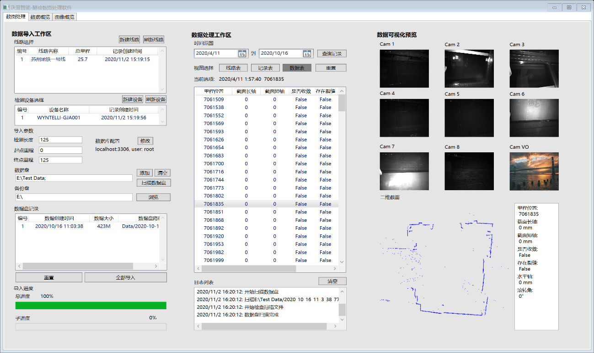

# FileIO_UI

**隧道智能检测系统数据后处理软件**

## [软件简介 Introduction]

分析csv数据文件并解析mjpeg视频，基于WPF开发的数据库操作软件。

An application analysing both csv data and mjpeg video, including MySQL database
operations.

## [软件界面截图 Screenshot of software]

## [功能描述 Description]

## 一、全数据拷贝

插入硬盘后，数据由车载端移动数据盘拷贝到车站端工作站硬盘中。备份并上传数据库成功后将车载端移动数据盘格式化以备下次使用。

1.  路径输入：输入输出路径窗口选择

2.  路径判断：判断是否为合格可用的数据文件，确认文件夹目录格式正确

3.  拷贝进度显示：进度条刷新

4.  拷贝结果检验

5.  数据上传备份后硬盘格式化

## 二、数据记录导入及初始化

线路信息，检测设备信息，检测记录信息的导入及初始化。

1.  轨交线路表

    输入：轨交线路编号，轨交线路中文名称，总里程

    自动：记录创建时间，有效符

2.  检测设备信息表

    输入：检测设备编号，检测设备名称，

    自动：记录创建时间，有效符

3.  检测记录表

    输入：检测线路编号，检测设备编号，检测长度，起始位置，停止位置

    自动：检测时间（数据文件根目录名称）

## 三、数据处理

从拷贝到本地端的文件中提取数据文件，进行分析后存入数据库。待处理的数据包括CalResult中ResultX.csv测量数据文件、EncodeResult中的Camera00XXXXXXXXX_Image/Timestamp_00XXXXXXXXX.csv图像时间戳记录文件以及里程计、陀螺仪数据等其他待处理的csv数据文件。

**数据存储目录示意**

**---\>** 2020-4-10-23-18-7-813\*\*（\*\*时间目录）

**-------\>** CalResult（数据目录）

\------------\> ResultX.csv

\-------\> EncodeResult（图像目录）

\------------\> Camera00XXXXXXXXX_Image

\------------------\> Camera_00XXXXXXXXX.mjpeg

\------------------\> TimeStamp_00XXXXXXXXX.csv

1.  CalResult数据文件导入数据库中DataRaw表。

2.  里程计数据文件导入数据库中TandD表。

3.  8台相机CalResult数据根据时间戳整合、经模型转换后导入DataConv表。

4.  根据记录号搜索该记录下正常工作的相机。

5.  选取一台正常工作的相机为基准相机。

6.  分批次查询基准相机该记录下的N条DataRaw数据记录，并通过时间戳间隔计算帧间隔，帧间隔30%作为时间对齐标准。

7.  搜索其他相机与基准相机对齐的时间戳，以基准相机时间戳±帧间隔的30%为对齐条件。

8.  对齐后的8台相机数据模型转换（x-y,
    s-a），转换后的数据存入DataConv表，未正常工作的相机中的数据点置全零。

9.  根据8台相机对应时间戳查询TandD表中相近（±K倍帧间隔）的里程数据，根据最近的前后两个时间戳下的里程值，计算相机对应时间的里程值。（认为两里程时间戳间的较短时间内，速度均匀无变化）

    转换后的里程对应存入DataConv表。

10. 将DataConv中的极坐标数据转化为Json格式的转发字符串

    （“{value:[x,y,z],itemStyle:{color:’blue’}},”\*2048组），并存入DataDisp表。（转换前对极坐标数据结果进行滤波降噪）

11. 将DataConv中的极坐标数据解算为截面拟合参数（长短轴，水平轴，旋转角）并存入DataOverview表。

## 四、图像处理

从拷贝到本地端的文件中提取MJPEG文件，并解码为单帧图像后，将前端呈现所需的文件路径（URL）存入数据库，并对多台相机拍摄的图像进行时间戳对齐。

1.  将EncodeResult中各相机拍摄的MJPEG视频解码为JPEG图像，并按照相应格式存入DecodeResult中。

2.  提取各相机图像文件路径，存入IamgeRaw表。

3.  8台相机图像文件路径根据时间戳整合，导入ImageDisp表。

4.  根据记录号查找正常工作的相机。

5.  选取一台正常工作的基准相机。

6.  分批次查询基准相机该记录下的N条ImageRaw数据记录，并通过时间戳间隔计算帧间隔，帧间隔30%作为时间对齐标准。

7.  搜索其他相机与基准相机对齐的时间戳，以基准相机时间戳±帧间隔的30%为对齐条件。

8.  对齐后的8台相机图像路径存入ImageDisp表，未正常工作的相机中的数据点置空。

9.  同 **三、数据处理** 中（9）

## 五、数据呈现设计

数据呈现设计为多表逻辑递进形式，主表为按输入时间检索的检测记录（DetectRecord）表，可按线路编号和设备编号归类查找。检测记录表行内容单击，呈现该检测记录下的数据记录（DataConv），同时展示时间戳/距离最近的图像。

## 六、前端指令处理
